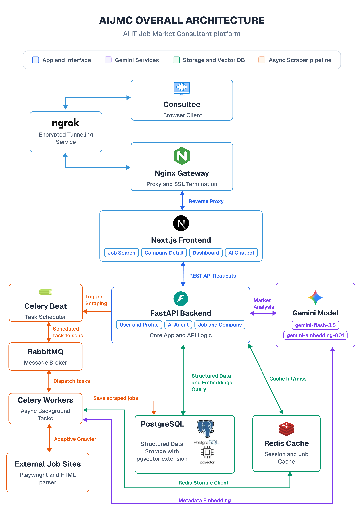
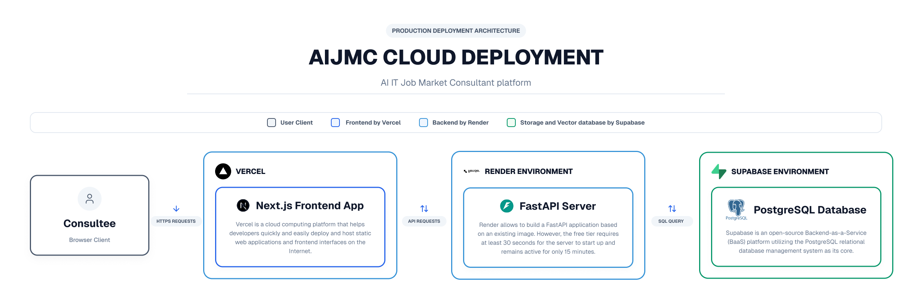
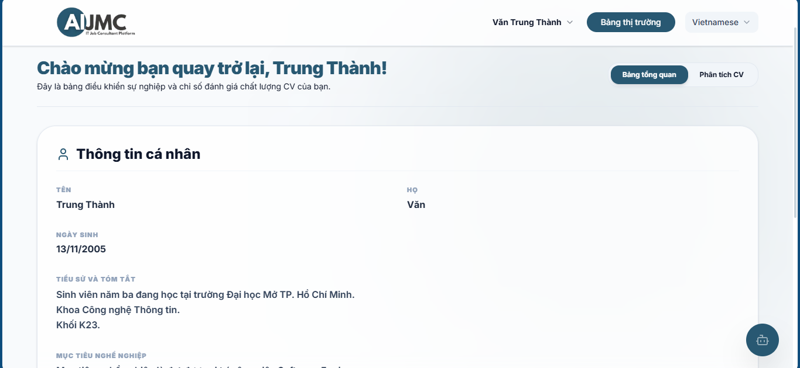
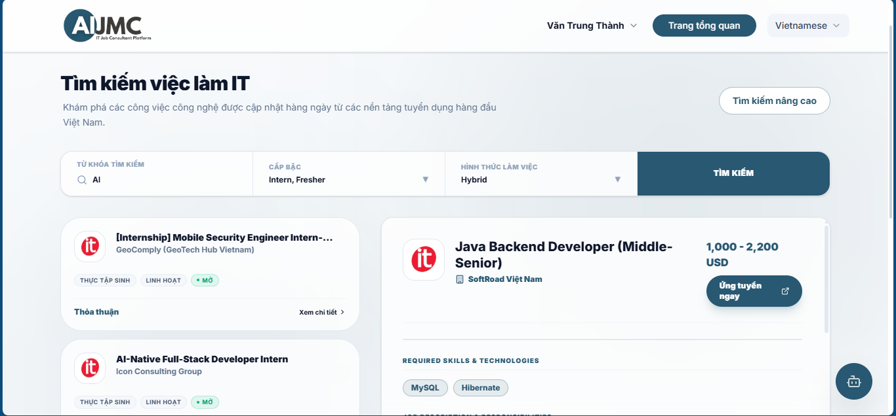
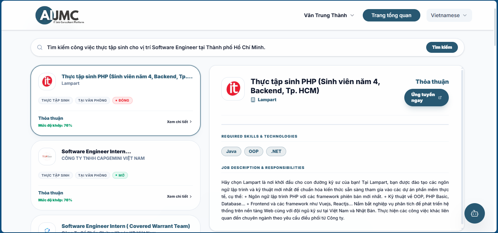
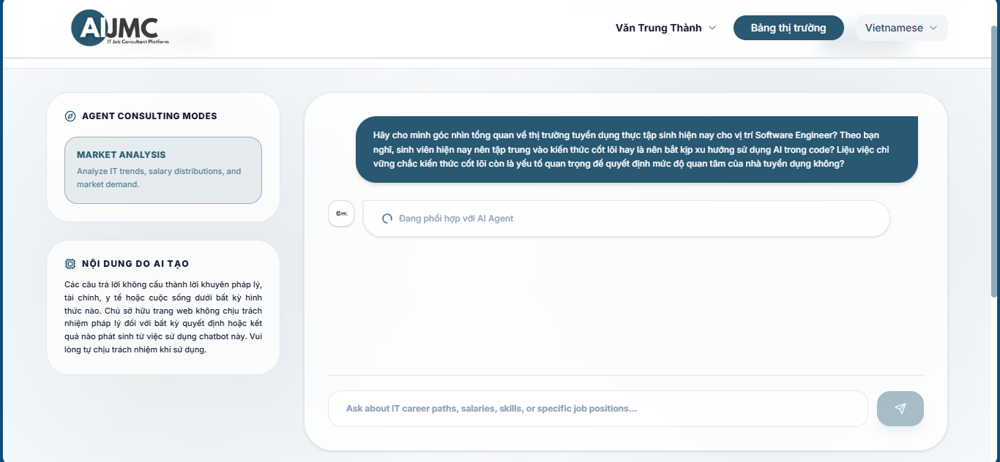
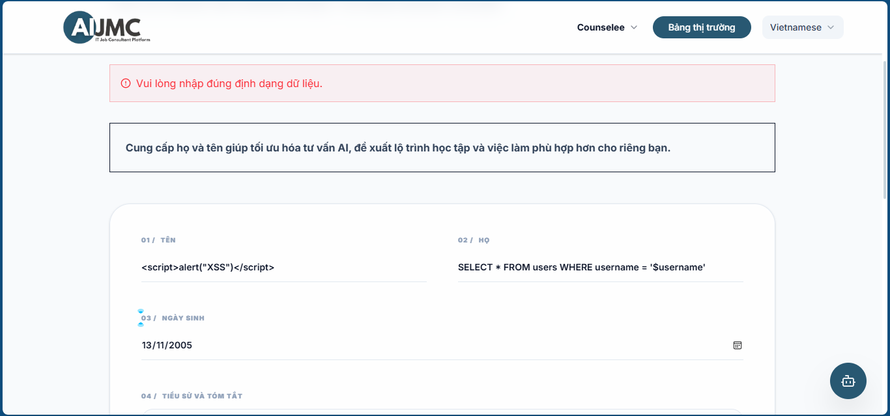
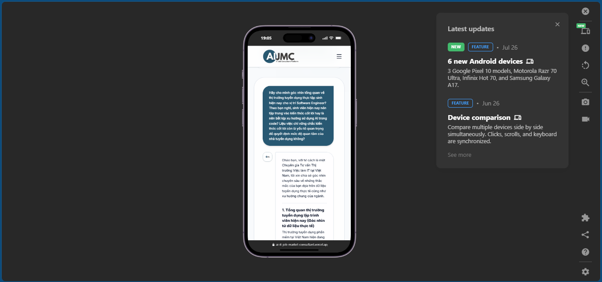

# AI-IT-JOB-MARKET-CONSULTANT
AI IT Job Market Consultant (AIJMC), also known as an IT Job Market analyst system. This system solves three aspects of today's IT job market requirements problems. The first aspect is providing a Job Consultant System amid today's downward trend. The second aspect is solving the lack of an efficient way for IT job seekers to find suitable jobs. The final aspect is proving the theory of AI Agent with ReAct framework applications for solving Job Consultant problems.

## I. Project Description
### 1. Main goal
The overall objective of this project is to develop an IT Job Market Consultant System based on an AI Agent with the ReAct framework. This system is capable of collecting, processing, and analyzing recruitment data from ITViec, TopDev, ITJobs, and Vietnamworks. The fundamental theory of this project is based on the AI agent research by [Nguyen et al.](https://arxiv.org/pdf/2511.14767). At the same time, the system can provide career counseling and suggest suitable job opportunities for users based on theories from the survey by [Q. Peng](https://arxiv.org/abs/2502.10050) and the research by [Wang et al.](https://arxiv.org/abs/2508.13423). Also, AIJMC will learn an efficient way of data mining from the research by [Dinh et al.](https://arxiv.org/abs/2603.05262).

### 2. Project Aim
With a 10-week implementation period, the specific objectives include:

1. Objective 1: Collect and analyze service system requirements based on document research and surveys of existing systems in week 2. Synthesize the theoretical basis of AI Agents and hybrid retrieval techniques, RAG, and reordering by the end of week 3.
2. Objective 2: Build Celery with automated tasks to collect and embed data from the IT team recruitment platform, tasks to update recruitment status, and logical task backups. Results completed by the end of week 4.
3. Objective 3: Design and build AI Agent field analysis for the system using three techniques: hybrid retrieval, RAG, and reordering. Results completed before the end of week 7.
4. Objective 4: Develop a web application with recruitment search functionality by query or combined retrieval, view job details, and analyze chatbot data accumulated based on AI Agents. Additionally, the system will store activity logs for the purpose of the following function. Results will be completed by the end of week 9.
5. Objective 5: Establish a deployment basis using ngrok to assess slow speed, feasibility of data collection, speed compatibility with Cosine, and perform acceptance testing with a rate test case pass rate of over 80% in week 10.

See more project detail plan at: [thesis_report_plan.md](docs/references/thesis_report_plan.md)

## II. Technologies
The system has 9 main components, with each has different role. The main languages used are Python and JavaScript. Makefile is also used for developing system tools and automation.

| Components | Technology | Version / Stack | Reason for use |
| :--- | :--- | :--- | :--- |
| **Frontend** | Next.js |  Next.js 16.2+, React 19.2+, TailwindCSS 4.3+, shadcn/ui 4.16+ | It provides an interface that allows users to interact with job posting search functions, view details, and chat with a chatbot. Interaction data will be sent to the backend for processing. |
| **Backend** | FastAPI | FastAPI 0.139+, Pydantic 2.13+, GenAISDK 2.14+, LangChain 1.3+ | The system handles business logic, provides RESTful API functionality, manages data and migration instances based on Alembic, and organizes and logs AI agent activity. |
| **Database** | PostgreSQL with pgvector | PostgreSQL 18+, pgvector 0.5+ | Stores structured job data and vector embeddings together, which is useful for semantic search, recommendation, and RAG workflows. |
| **Message Broker** | RabbitMQ | RabbitMQ 3.13+ | Used by Celery Beat and Celery Worker, Rabbitmq acts as an intermediary for transmitting and distributing Celery Beat's scheduled appointments. |
| **Caching** | Redis | Redis 8.1+ | Temporarily store user query results and Adaptive Crawler recruitment data extraction results using Redis StorageClient. |
| **Celery Worker** | Celery + Crawl4AI + Crawlee |  Celery 5.4+, Crawlee 1.9+, Crawl4AI 0.9+ | Execute background tasks such as extracting and updating job posting data, and perform logical backups without interrupting backend components. |
| **Celery Beat** | Celery | Celery 5.4+ | Schedule and automatically trigger recurring tasks at pre-configured times. |
| **Reverse Proxy** | Nginx | Nginx 3.24+  | In receiving and forwarding requests from users to backend components, nginx acts as a unified access point for the system. |
| **Public Tunnel** | Ngrok | Ngrok 3+ | Provide a public IP address to forward Internet traffic, such as Browser Client traffic, to the system in the simulated deployment environment. |
| **Tools automation** | Makefile | pytest 9.1+, Vitest 4.1+, Playwright 1.62+, Ruff 0.15+ and others dev tools | Supports automated testing, code quality checks, and reliable maintenance across the project. |

## III. System Architecture
The system architecture according to ADR-01 is client-server. In addition, the backend will be organized in a modular style using layered architecture. The frontend will follow a modular components structure. The system will prioritize three key criteria: security, performance, and scalability. Moreover, some design patterns will be applied to ensure the maintainability of the source code.

A detailed description of the system architecture is provided in [ADR-01-Software-Architecture.md](docs/adrs/ADR-01-Software-Architecture.md)




## IV. System startup guidance

### Application Requirements

```text
1. Minimum hardware requirements: Intel Core i7-3537U (2 cores, 4 threads, base clock speed 2.00 GHz), Intel HD Graphics 4000, RAM: 8 GB.

2. Program requirements: Docker version 24+, Git latest.

3. Package manager requirements: Python 3.14 and uv 0.11.28+

4. JavaScript runtime environment: Node.js v24.14.1+

5. Tools automation build: GNU Make 4.4.1+

6. Environment variables (necessary): Use the environment examples to create a standard environment file configuration.

7. Browser: Edge Version 152.0.4191.53, Google Chrome Version 152.0.7977.64
```

### Environment variables setup
See the detailed meaning of each environment variable at [Environment Variables Explanation](docs/references/environment_variables_explanation.md)

### Application startup steps

1. First, you must make sure all the "Application Requirements" are met. After that, open bash to run the code below (stand in the AI-IT-Job-Market-Consultant folder):

```bash
  make install
```

2. Second, you need to configure the .env file using the standard .env.example. For generation secret-key run:

```bash
  make generate-secret
```

Also, you need to configure the rclone.conf in the celery folder with the standard rclone.conf.example (This is crucial if you want the backup task to work).
See how to configure rclone.conf at [Rclone Configuration Tutorial](docs/references/rclone_configuration_tutorial.md)

3. Third, you will run Docker and build the Docker image in development mode:

```bash
  make dev-app-build
```

or production mode:

```bash
  make prod-app-build
```

4. Finally, you need to wait for Docker to build the app. It usually takes 5-30 minutes based on your hardware.

5. If you want to bring down the container. Run:

```bash
  make dev-app-down
```

or production mode:

```bash
  make prod-app-down
```

## V. AIJMC Cloud Platform Deployment
[Click here to go to the platform](https://ai-it-job-market-consultant.vercel.app/en)

AIJMC utilizes three cloud platforms Vercel, Render, and Supabase to operate its system. Its advantages include near 24/7 uptime, while its disadvantages include performance trade-offs, complex configurations, and very high latency of 20-60 seconds. The detailed AIJMC cloud workflow is illustrated in the image below:



## VI. Documentation
- [ADR](docs/adrs/)
- [AIJMC Legal Aspect](docs/references/aijmc_legal_aspect.md)
- [AIJMC Project License](docs/license/)
- [API Documentation](docs/apis/)
- [Architecture](docs/architectures/)
- [References](docs/references/)
- [Software Requirements Specification](docs/srs/)

## VII. Showcase

### 1. Feature Showcase

**Home Page (English)**
  

**Market Overview Panel**
  

**Job Market Search**
  

**Semantic Search Results**
  

**AIJMC Chatbot Interface**
  

### 2. Non-Feature Showcase

**XSS and SQL Injection Security Protection**
  

**Admin Control Panel**
  

**Mobile First Responsive Design**
  

More showcases here: [Feature Showcase](docs/showcase/feature/) | [Non-Feature Showcase](docs/showcase/non-feature/)


## VIII. Project Structure
```text
AI-IT-Job-Market-Consultant/
├── LICENSE
├── Makefile
├── README.md
├── commitlint.config.js
├── docker-compose.override.yml
├── docker-compose.prod.yml
├── docker-compose.yml
├── pyproject.toml
├── release-notes.md
├── sonar-project.properties
├── backend/
│   ├── Dockerfile
│   ├── README.md
│   ├── alembic.ini
│   ├── pyproject.toml
│   ├── agents/
│   ├── app/
│   ├── database/
│   ├── scripts/
│   └── tests/
├── celery_app/
│   ├── Dockerfile
│   ├── README.md
│   ├── pyproject.toml
│   ├── celery_app.py
│   ├── rclone.conf
│   ├── rclone.conf.example
│   ├── scripts/
│   ├── tests/
│   └── tools/
├── database/
│   ├── README
│   ├── alembic.ini
│   ├── env.py
│   ├── script.py.mako
│   └── versions/
├── docs/
│   ├── adrs/
│   ├── apis/
│   ├── architectures/
│   ├── references/
│   ├── showcase/
│   ├── srs/
│   ├── stage-report/
│   └── testing/
├── frontend/
│   ├── Dockerfile
│   ├── README.md
│   ├── components.json
│   ├── eslint.config.mjs
│   ├── jsconfig.json
│   ├── next.config.mjs
│   ├── nginx.conf
│   ├── package.json
│   ├── playwright.config.ts
│   ├── postcss.config.mjs
│   ├── public/
│   ├── src/
│   ├── test-results/
│   └── tests/
├── notebooks/
│   ├── 01_crawler_data_quality.ipynb
│   ├── 02_crawler_data_exploration.ipynb
│   ├── crawler_data/
│   └── notebooks_results/
└── scripts/
    ├── add_latest_release_date.py
    ├── clean_temporary_files.py
    ├── create_staging_env.sh
    ├── generate_secret_key.py
    ├── compose/
    ├── release/
    └── security/
```
