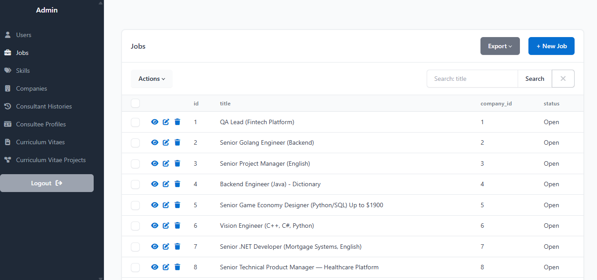
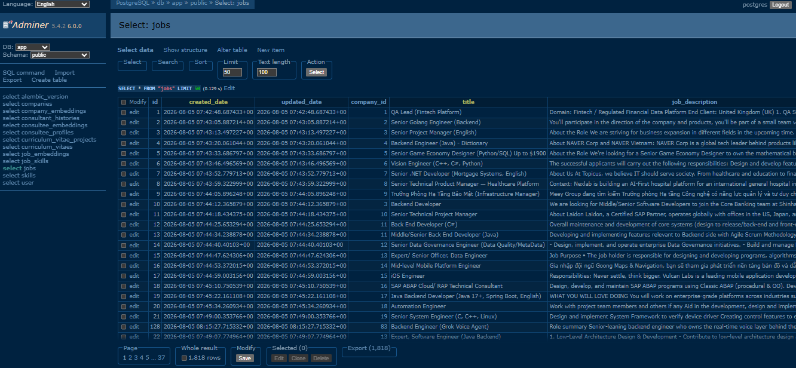
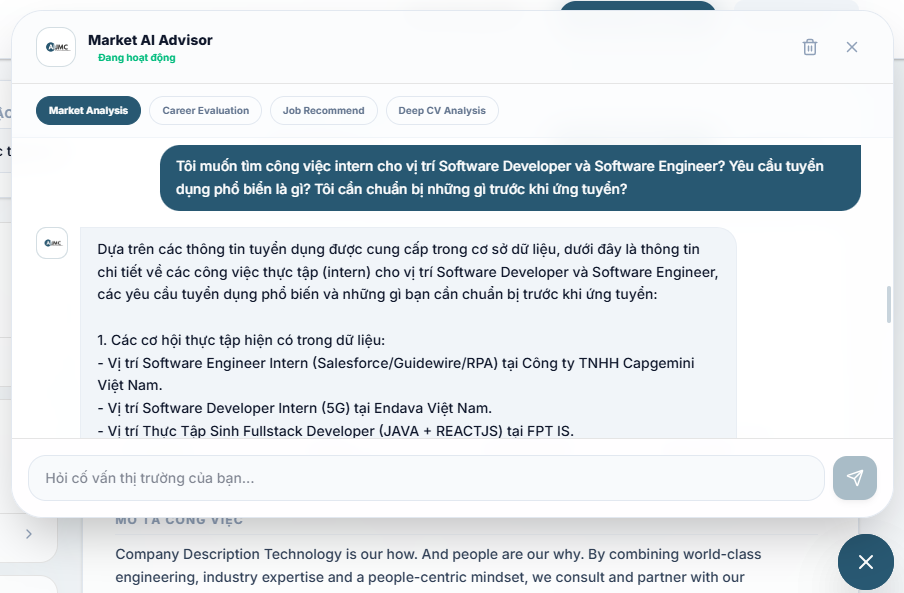
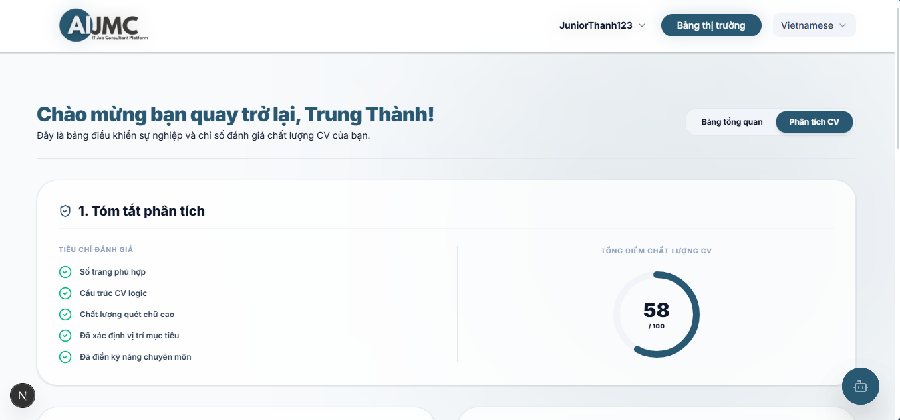
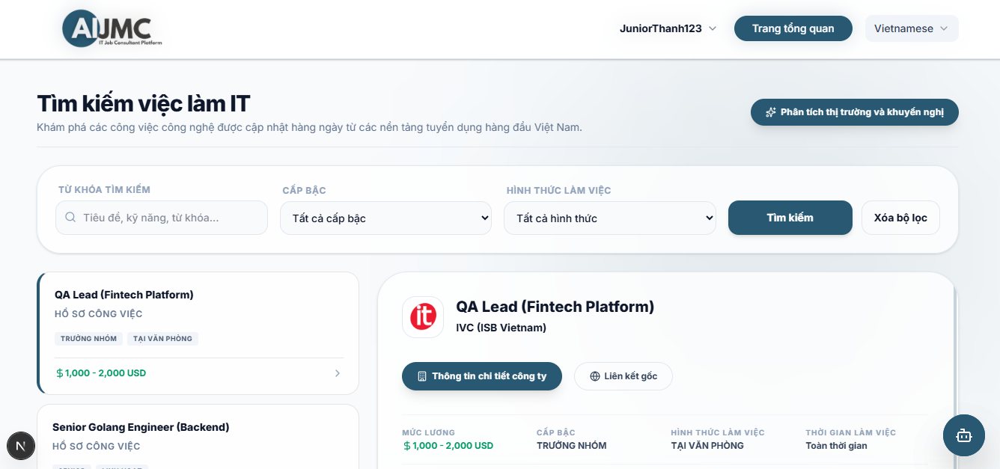
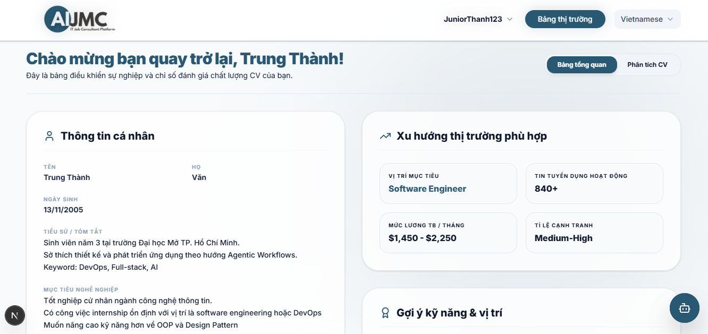

# AI-IT-JOB-MARKET-CONSULTANT
AI IT Job Market Consultant (AIJMC), also known as an IT Job Market personalization system. This system solves three aspects of today's IT job market problems. The first aspect is providing a Job Consultant System amid today's low trend. The second aspect is solving the lack of an efficient way for IT job seekers to find suitable jobs. The final aspect is proving the theory of multi-agent applications for solving Job Consultant problems.          

## I. Project Description
### 1. Main goal
The overall objective of this project is to develop an IT Job Market Consultant System based on a multi-agent architecture. This system is capable of collecting, processing, and analyzing recruitment data from multiple sources. The fundamental theory of this project is based on the AI agent research by [T. M. Nguyen and colleagues](https://arxiv.org/pdf/2511.14767). At the same time, the system can provide career counseling and suggest suitable job opportunities for users based on theories from the survey by [Q. Peng](https://arxiv.org/abs/2502.10050) and the research by [Q. Wang and colleagues](https://arxiv.org/abs/2508.13423).

### 2. Project Aim
With a 10-week implementation period, the specific objectives include:
1. Objective 1: Collect and analyze business requirements related to the IT Job Market Consultant System using literature review and user story techniques. The result is the [System Requirements Specification (SRS)](docs/srs/) by the end of Week 2.
2. Objective 2: A comprehensive overview of theories and technologies related to AI agents, multi-agent architectures, large language models, and AI techniques such as RAG and semantic search. The result is Chapter 2 Theoretical Foundations in the graduate report, which is to be completed by the end of Week 3.
3. Objective 3: Design and build a multi-agent system with all three main agents, including the IT job market analysis agent, the personalization agent, and the recommendation agent. The project must be completed by the end of Week 7.
4. Objective 4: Develop a web app platform with three main features: job search, a consultation chatbot, and a dashboard for analyzing individual skills. The project is scheduled for completion by the end of Week 8.
5. Objective 5: Deploy the platform to a VPS to conduct acceptance testing and document the results to finalize the report during weeks 9–10.

## II. Technologies
Note: Based on the research [An LLM-Powered Agent for Real-Time Analysis of the Vietnamese IT Job Market](https://arxiv.org/pdf/2511.14767), this project proposes using some technologies in the table below. The official technologies will be announced in the near future.

| Core structure | Technology | Version | Reason for Use |
| :--- | :--- | :--- | :--- |
| **Backend** | FastAPI (with SQLAlchemy and Pydantic) | FastAPI 0.116+, SQLAlchemy 2.x,Pydantic 2.x | Provides a lightweight, high-performance REST API for serving job data, semantic search, and AI assistant endpoints. FastAPI integrates naturally with LangChain and asynchronous Python applications. |
| **Frontend** | React (Vite) | React 19 + Vite 7 | Builds a responsive Single-Page Application (SPA) for job search, dashboard visualization, and AI-assisted interaction while offering fast development and optimized build performance. |
| **Database** | PostgreSQL (with pgvector) | PostgreSQL 17 + pgvector 0.8+ | Stores structured job information together with vector embeddings, enabling both traditional SQL queries and semantic similarity search within a single database engine. |
| **Data Collector** | Playwright and Adaptive HTTPs crawler | 1.54+ | Automates crawling of job postings from TopDev and ITviec while handling JavaScript-rendered pages and modern anti-bot mechanisms. This follows the data collection approach described in the reference paper. |
| **RAG and Semantic Search** | LangChain + Gemini API | LangChain 0.3+ Gemini 2.5 | Builds Retrieval-Augmented Generation pipelines, semantic search, prompt orchestration, and AI tools. Gemini performs information extraction, career consultation, and reasoning over retrieved job postings. |
|Embedding Model | Gemini Embedding | Gemini Embedding-001 | Converts job descriptions into dense vector representations for semantic similarity search, retrieval, and Retrieval-Augmented Generation (RAG). The generated embeddings are stored in PostgreSQL using pgvector |
| Visualization | Chart.js | 4.x | Provides interactive visualizations of hiring trends, technology demand, salary distribution, and experience requirements to improve data interpretation for users. |

## III. System Architecture
The planned architecture will be client-server. The backend will be organized using a layered architecture. The system will prioritize two key criteria: performance and availability. In addition, design patterns will be applied to ensure the maintainability of the source code.
A detailed description of the system architecture is provided in [ADR-01-Software-Architecture.md](ADR-01-Software-Architecture.md) <br>
[Architecture overview image (not available)](docs/architectures/)

## IV. Project Structure
```text
AI-IT-Job-Market-Consultant/
├── AGENTS.md
├── LICENSE
├── Makefile
├── README.md
├── commitlint.config.js
├── docker-compose.override.yml
├── docker-compose.prod.yml
├── docker-compose.yml
├── pyproject.toml
├── release-notes.md
├── sonar-project.properties
├── backend/
│   ├── Dockerfile
│   ├── README.md
│   ├── alembic.ini
│   ├── pyproject.toml
│   ├── agents/
│   ├── app/
│   ├── database/
│   ├── scripts/
│   └── tests/
├── celery/
│   ├── Dockerfile
│   ├── README.md
│   ├── pyproject.toml
│   ├── celery_app.py
│   ├── rclone.conf
│   ├── rclone.conf.example
│   ├── scripts/
│   ├── tests/
│   └── tools/
├── database/
│   ├── README
│   ├── alembic.ini
│   ├── env.py
│   ├── script.py.mako
│   └── versions/
├── docs/
│   ├── adrs/
│   ├── apis/
│   ├── architectures/
│   ├── references/
│   ├── showcase/
│   ├── srs/
│   ├── stage-report/
│   └── testing/
├── frontend/
│   ├── AGENTS.md
│   ├── Dockerfile
│   ├── README.md
│   ├── components.json
│   ├── eslint.config.mjs
│   ├── jsconfig.json
│   ├── next.config.mjs
│   ├── nginx.conf
│   ├── package.json
│   ├── playwright.config.ts
│   ├── postcss.config.mjs
│   ├── public/
│   ├── src/
│   ├── test-results/
│   └── tests/
├── notebooks/
│   ├── 01_crawler_data_quality.ipynb
│   ├── 02_crawler_data_exploration.ipynb
│   ├── crawler_data/
│   └── notebooks_results/
└── scripts/
    ├── add_latest_release_date.py
    ├── clean_temporary_files.py
    ├── create_staging_env.sh
    ├── generate_secret_key.py
    ├── verify_container_health.sh
    ├── compose/
    ├── release/
    └── security/
```

## V. Showcase

Admin Panel
  

Adminer Panel (Only in development)
  

Chatbot of AIJMC
  

CV Scoring of AIJMC
  

Market dashboard of AIJMC
  

Profile_Dashboard
  

More showcase here: [The showcase folder](docs/showcase/)


## VI. How to use it
There are two main ways to use this system.

1. First, you can use the web that is already deployed. In this case, you only need to accept the terms and conditions, then register and log in. After that, you can access most features, such as job search, CV analysis, and the AIJMC chatbot. Please note that you should not share sensitive personal information.

2. Second, if you want to run the project locally, you need to prepare the environment files first. Create a .env file based on the .env.example template, and create a .rclone.conf file based on the .rclone.conf.example template in the celery folder. After that, you can start the project locally and use the same features. Note: Knowledge about Docker and system understanding are required.

## VII. Deployment
For the VPS deployment, the project is planned to use a server with a strong and stable setup:
1. A possible option is a server with an Intel Xeon E5-26xx v4 CPU, 2.3 GHz base speed and 3.7 GHz turbo speed, 70 GB NVMe SSD storage, 8 GB RAM, 4 vCPU cores, 10 Gbps network port, and 99.9% uptime.
2. Another possible option is a server with 5 vCPU cores, 6 GB RAM, 80 GB SSD storage, unlimited data transfer, 300 Mbps domestic bandwidth, free anti-DDoS protection, Linux or Windows support, one IPv4 address, and 99.9% uptime.

For local deployment, the team is also considering using Ngrok, Cloudflare Tunnel, and a purchased domain. This option is still under discussion, but it can be useful for testing and presenting the system in a simple way.

## VIII. Documentation
- [ADRs](docs/adrs/)
- [API Documentation](docs/apis/)
- [Architecture](docs/architectures/)
- [References](docs/references/)
- [Software Requirements Specification](docs/srs/)
- [AIJMC Legal Aspect](celery/tools/adaptive_crawler/crawl_website_information/aijmc_legal_aspect.md)
