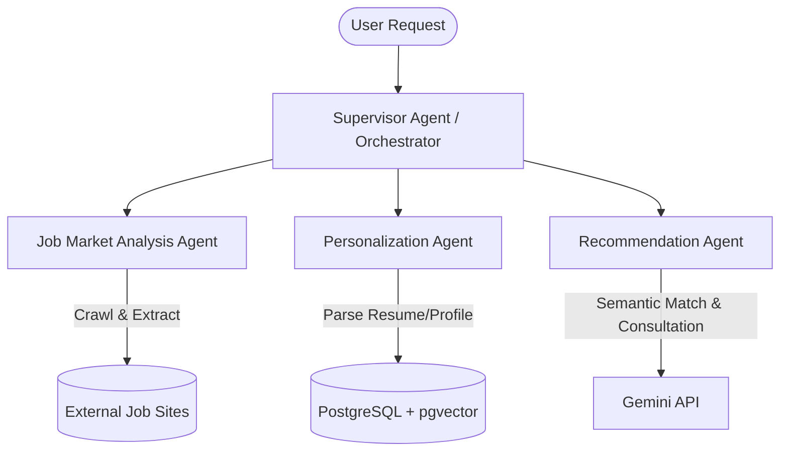

# AI-IT-Job-Market-Consultant - Multi-Agent Orchestration Layer

This directory houses the **Multi-Agent Orchestration Layer** of the **AI IT Job Market Consultant (AIJMC)** system.

---

## I. Architectural Decisions & Tech Stack

Following the system's Architecture Decision Records (ADRs):
*   **Orchestration Pattern:** **Hierarchical Multi-Agent System (HMAS)** (ADR-05). Tasks are executed sequentially via centralized coordination rather than allowing sub-agents to operate autonomously without control.
*   **Core Framework:** **LangGraph** (ADR-06). LangGraph enables defining the multi-agent workflow as a stateful, cyclical execution graph containing node agents and conditional edges.
*   **Generative AI Models:** Orchestrated using LangChain to query the **Gemini API** for semantic information extraction, profile parsing, and career consultations.
*   **Scraping & Data Cleansing:** Powered by **Playwright** and **Crawl4AI** (ADR-06) to scrape dynamic websites and format results into clean Markdown.

---

## II. Agent Architecture & Role Delegation

The multi-agent system divides business tasks into distinct agent roles coordinated by a supervisor:

### 1. Supervisor Agent & Orchestrator (`supervisor.py`, `orchestrator.py`)
*   Defines the LangGraph execution layout and coordinates states.
*   Determines which worker agent should execute next based on the workflow state.
*   Performs centralized routing to prevent redundant LLM queries and verify schemas before passing variables.

### 2. Job Market Analysis Agent (`worker_1.py`)
*   Crawls external IT job boards (such as TopDev and ITviec).
*   Extracts hiring listings, parses JavaScript pages, and converts raw HTML to cleaned, LLM-ready markdown formats.

### 3. Personalization Agent (`worker_2.py`)
*   Extracts and parses user profiles, skillsets, resumes, and career development targets.
*   Structures and personalizes this data before writing it to the PostgreSQL database.

### 4. Recommendation Agent (`worker_3.py`)
*   Performs hybrid relational and semantic vector similarity search via `pgvector` in PostgreSQL to match the candidate's profile against scraped job postings.
*   Sends matched records to the Gemini API, generating customized career advice, roadmap suggestions, and job recommendations.

Note:
3. Default "prefork" pool is a known bad fit for Playwright

Celery's default pool is prefork (fork-based multiprocessing). Playwright objects cannot be pickled and passed to children, so a browser instance must be initialized inside the task or via the worker_process_init signal to create a per-process browser instance rather than relying on default fork behavior. Left as-is, this risks broken/duplicated browser handles across forked workers, hangs, or crashes under real crawl load.
Fix: either explicitly set --pool=solo or --pool=threads in the CMD (the solo pool executes tasks in the main process/thread, which aligns with Playwright's blocking sync API — scale by running multiple worker containers instead of multiple forked processes), or if you need prefork's parallelism, initialize/tear down the browser per worker process explicitly via Celery's worker_process_init/worker_process_shutdown signals instead of at import time. Note: switching away from prefork silently disables some prefork-only features like soft_timeout and max_tasks_per_child, so factor that into the choice.
