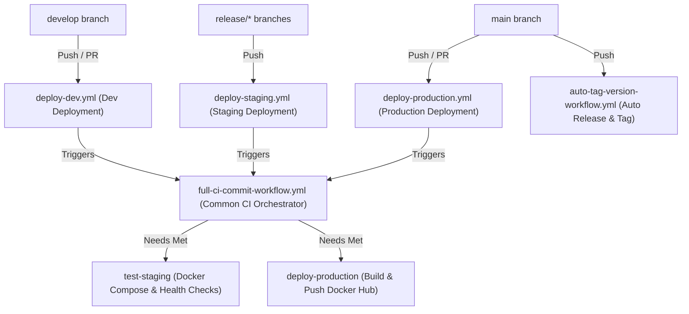
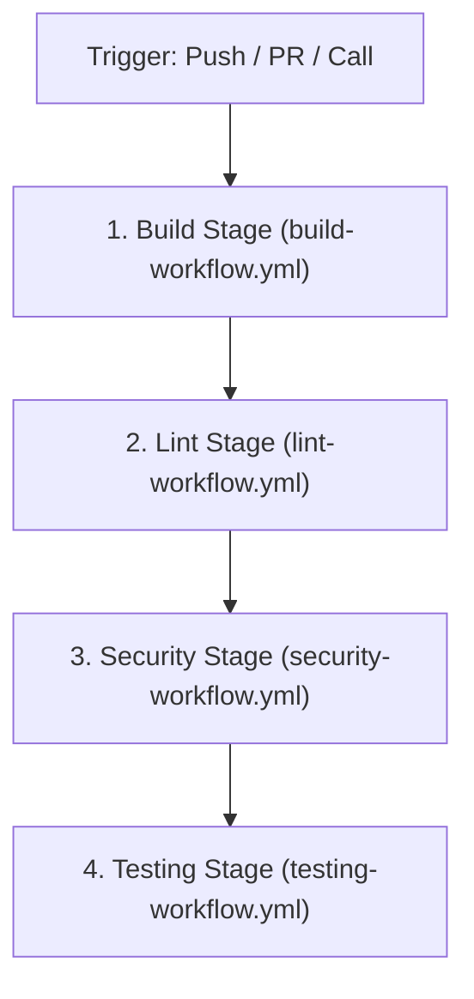
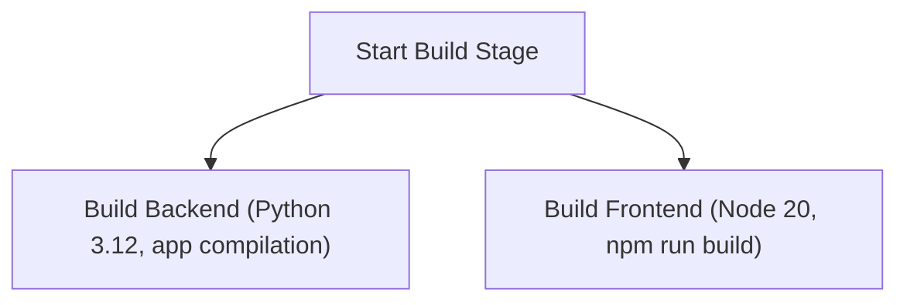
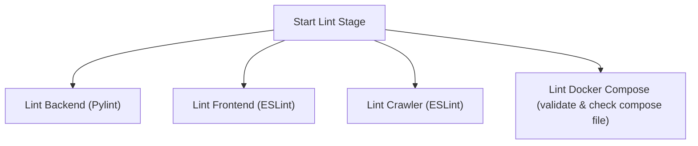
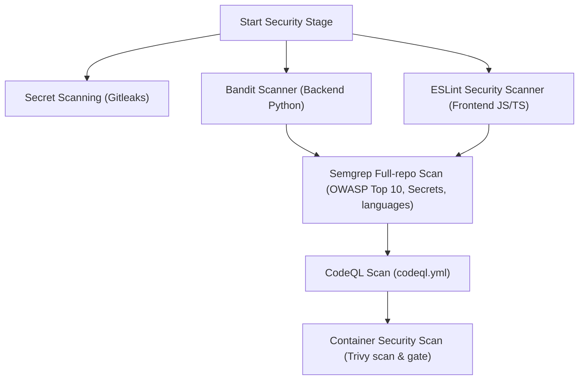
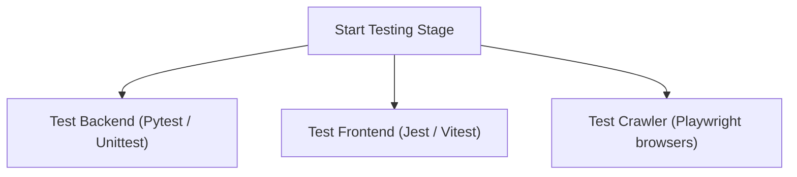

# 🚀 CI/CD Pipeline Architecture & Workflows

This document outlines the CI/CD pipeline structure for the **AI-IT-Job-Market-Consultant** project. The project utilizes **14 GitHub Action workflows** organized into entrypoint deployment pipelines, an orchestrator workflow, and reusable sub-pipelines.

---

## 1. High-Level Branch Deployment Strategy
The pipeline triggers automatically based on the target branch of pushes and pull requests:

---

## 2. Reusable Orchestrator: Full CI Commit Workflow
The [full-ci-commit-workflow.yml](file:///C:/Users/Kisune_Alvarez/Desktop/MyProjects/AI-IT-Job-Market-Consultant/.github/workflows/full-ci-commit-workflow.yml) serves as a reusable gatekeeper that runs builds, linting, security, and tests sequentially.

---

## 3. Sub-Workflow Details

### A. Build Stage (`build-workflow.yml`)
Runs Python and Node build validations in parallel.

### B. Lint Stage (`lint-workflow.yml`)
Runs syntax, style, and configuration checks in parallel.

### C. Security Stage (`security-workflow.yml`)
A robust multi-tier scanning process enforcing quality and container gates.

### D. Testing Stage (`testing-workflow.yml`)
Verifies execution logic across python backend tests, frontend unit tests, and crawler playwright browser tests.

---

## 4. Utility & Automation Workflows
These workflows run independently for repository health, automation, and bookkeeping:

*   **[detect-conflicts.yml](file:///C:/Users/Kisune_Alvarez/Desktop/MyProjects/AI-IT-Job-Market-Consultant/.github/workflows/detect-conflicts.yml):** Runs on push and PR synchronize to detect and label merge conflicts.
*   **[labeler.yml](file:///C:/Users/Kisune_Alvarez/Desktop/MyProjects/AI-IT-Job-Market-Consultant/.github/workflows/labeler.yml):** Automatically labels PRs based on file changes and validates that at least one primary label is applied before merge.
*   **[latest-changes.yml](file:///C:/Users/Kisune_Alvarez/Desktop/MyProjects/AI-IT-Job-Market-Consultant/.github/workflows/latest-changes.yml):** Generates and appends release notes automatically to `release-notes.md` upon PR merges into `master`.
*   **[zizmor.yml](file:///C:/Users/Kisune_Alvarez/Desktop/MyProjects/AI-IT-Job-Market-Consultant/.github/workflows/zizmor.yml):** Runs a security audit lint on the GitHub Action workflows themselves to check for dangerous triggers and insecure steps.
